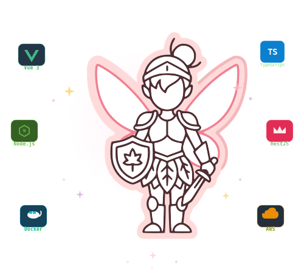

<div align="center">
  

  

  **Hi, I'm Isabela — I build things that work, for people who need them. 🌸**
</div>

<br>

<div align="center">🌸 ─── 🌸 ─── 🌸 ─── 🌸 ─── 🌸 ─── 🌸 ─── 🌸 ─── 🌸 ─── 🌸 ─── 🌸 ─── 🌸</div>

<br>

<div align="center">
  
</div>

<br>

<div align="center">🌸 ─── 🌸 ─── 🌸 ─── 🌸 ─── 🌸 ─── 🌸 ─── 🌸 ─── 🌸 ─── 🌸 ─── 🌸 ─── 🌸</div>

<br>

<table>
  <tr>
    <td align="center">

**dev personality**

🗣️ I talk before I type
<br>
🐛 No bug is too small (I will find you)
<br>
🔥 I fix, I don't blame
<br>
🗺️ Give me the unknown
<br>
🌸 reliable · curious · flexible

  </td>
    <td align="center">

**realm status**

🗺️ Questing through Python
<br>
🛡️ Defending production
<br>
🍄 Available for side quests

  </td>
  </tr>
</table>

<br>

<div align="center">🌸 ─── 🌸 ─── 🌸 ─── 🌸 ─── 🌸 ─── 🌸 ─── 🌸 ─── 🌸 ─── 🌸 ─── 🌸 ─── 🌸</div>

<div align="center"><br>~ skills ~<br><br></div>

<div align="center">
  <summary>
    
  </summary>
  Vue 3 🌸 Primary weapon · TypeScript 🛡️ Always equipped · Tailwind
  <br>
  🎨 Battle style · Vue 2 · Pug · Stylus
  <br>
  ⭐ Main Spell Combo: Vue 3 + TypeScript + Tailwind

  <br>
  <summary>
    
  </summary>
  Node.js (Express) · ⚔️ Trusted blade · NestJS
  <br>
  🏰 Heavy armor · MongoDB (Mongoose)
  <br>
  🗄️ Memory vault

  <br>
  <summary>
    
  </summary>
  AWS (EC2 · S3 · Route 53) ☁️ Realm infrastructure
  <br>
  · Docker 🐳 Contained spells
  <br>
  · GitLab · Jira
</div>

<br>

<div align="center">🌸 ─── 🌸 ─── 🌸 ─── 🌸 ─── 🌸 ─── 🌸 ─── 🌸 ─── 🌸 ─── 🌸 ─── 🌸 ─── 🌸</div>

<div align="center"><br>~ leveling up ~<br><br></div>

```
Python        🔓 Unlocking  ▓▓▓░░░░░
React Native  🔓 Unlocking  ▓▓░░░░░░
AI/LLM Tools  🔓 Unlocking  ▓░░░░░░░
```

<br>

<div align="center">🌸 ─── 🌸 ─── 🌸 ─── 🌸 ─── 🌸 ─── 🌸 ─── 🌸 ─── 🌸 ─── 🌸 ─── 🌸 ─── 🌸</div>

<br>

<div align="center">
  <table>
    <tr>
      <td>
        
      </td>
      <td>
        
      </td>
    </tr>
  </table>

  
</div>

<br>

<div align="center">🌸 ─── 🌸 ─── 🌸 ─── 🌸 ─── 🌸 ─── 🌸 ─── 🌸 ─── 🌸 ─── 🌸 ─── 🌸 ─── 🌸</div>

<br>

<div align="center">

📜 [LinkedIn](https://www.linkedin.com/in/cioarec-andreea-isabela-234bb619b/) · 🪄 [Email](mailto:bala.andreea.isabella@gmail.com) · 🌿 [GitHub](https://github.com/AndreeaIsabela)

🌸 *Build something that matters today. It'll be a dream tomorrow.*
</div>
<p align="right">
  <details><summary>🍄</summary>

  Thanks for reading this far, you're clearly a person of culture. 🌸

  *"Someday we will dream about today and wonder how it slipped away."*

  </details>

</p>
